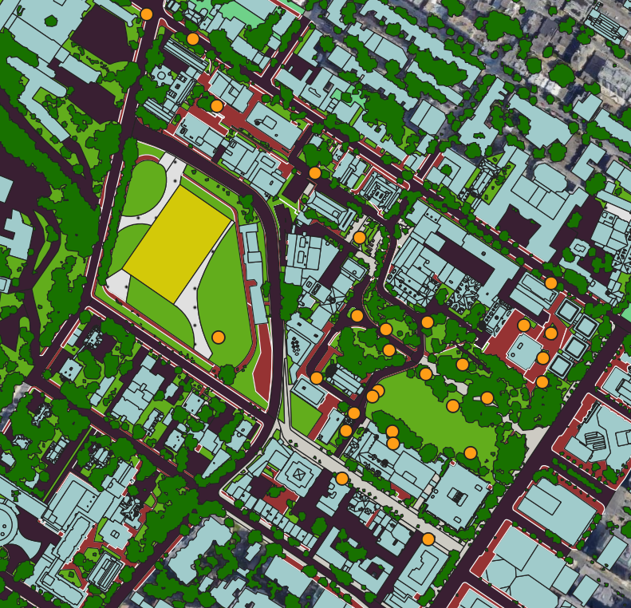

This project aimed to study urban heat island on a microscale by use of an IoT sensor network to monitor the temperature profile on McGill's downtown campus for a duration of a year (2022-2023). 

This network allows us to collect the intra-day and interday variation of temperature within a single sensor or throughout the network of sensors. Given our knowledge of the environmental profile of the campus, we are attempting to draw conclusions on the relationship between temperature profile at a given location and the urban characteristics of its immediate surroundings. Factors and characteristics such as proportion of built-up surfaces, tree cover, land cover and larger meterological phenomenon such as weather, wind and rainfall are the focus of this current project. 

With the health impacts of UHI wihin the population their immediate surroundings, delineating whether the heat distribution at a microscale is impacted by the envrionmental lanscape will inform policy makers, urban planner and researchers on how to best orient the design of the urban landscapes in addressing the looming urban heat crisis. 

